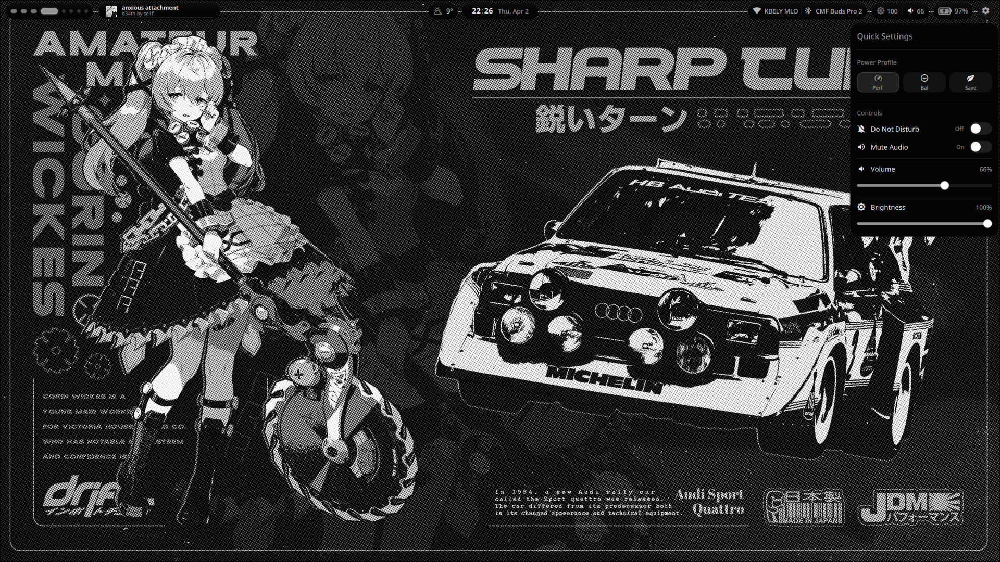

# Hyprland Rice

A minimal, clean, and highly customized Hyprland desktop setup with pywal color integration.



## Features

- **Window Manager**: Hyprland with smooth animations
- **Status Bar**: Custom Quickshell bar with media controls, weather, calendar
- **Lock Screen**: Hyprlock with transparent blur and pywal colors
- **App Launcher**: Minimal rofi configuration with pywal theming
- **Terminal**: Kitty with pywal integration
- **Wallpaper**: Supports static images and video wallpapers (awww & mpvpaper)
- **Color Scheme**: Automatic color generation with pywal

## Installation

### Prerequisites

- Arch Linux or Arch-based distribution
- Internet connection
- Basic knowledge of terminal commands

### Quick Install

```bash
git clone https://github.com/rawnullbyte/hyprland-rice.git
cd hyprland-rice
chmod +x install.sh
./install.sh
```

## Credits

- [MrVivekRajan/Hyprlock-Styles](https://github.com/MrVivekRajan/Hyprlock-Styles) - Lock screen style reference
- [pywal](https://github.com/dylanaraps/pywal) - Color scheme generation
- [Quickshell](https://github.com/quickshell-mirror/quickshell) - Status bar

## License

MIT
